# Informe: Aplicacion de sockets TCP en Python

## Introduccion

Los sockets permiten la comunicacion entre procesos a traves de una red o dentro de un mismo sistema. En este trabajo se desarrollo una aplicacion cliente-servidor utilizando el protocolo TCP, ya que ofrece una comunicacion orientada a conexion, confiable y ordenada.

La eleccion de TCP facilita la explicacion del flujo completo de una conexion: el servidor crea el socket, lo asocia a una direccion y puerto, queda a la escucha, acepta una conexion entrante y luego intercambia mensajes con el cliente. El cliente, por su parte, crea su socket, se conecta al servidor y comienza el envio y recepcion de datos.

El programa fue realizado en Python usando el modulo `socket`, que expone de forma directa los conceptos tradicionales de programacion de redes. De esta forma, es posible relacionar la teoria clasica de sockets con una implementacion practica y facil de ejecutar.

## Desarrollo

### 1. Descripcion general del programa

La aplicacion desarrollada consiste en dos programas:

- `servidor_tcp.py`: espera una conexion TCP, recibe mensajes y responde con una confirmacion automatica.
- `cliente_tcp.py`: se conecta al servidor y permite enviar mensajes desde consola.

La comunicacion termina cuando el cliente escribe la palabra `salir`.

### 2. Nomenclatura solicitada

La forma clasica de crear un socket en lenguaje C es la siguiente:

```c
int socket(int domain, int type, int protocol);
```

La llamada utilizada conceptualmente en este trabajo es:

```c
socket(AF_INET, SOCK_STREAM, 0);
```

Donde:

- `AF_INET`: indica que se utilizara direccionamiento IPv4.
- `SOCK_STREAM`: indica que se utilizara un socket orientado a flujo, propio de TCP.
- `0`: deja que el sistema seleccione automaticamente el protocolo adecuado.

En Python, la forma equivalente es:

```python
socket.socket(socket.AF_INET, socket.SOCK_STREAM, 0)
```

### 3. Funcionamiento del programa

#### Servidor

1. Crea el socket TCP con `socket.socket()`.
2. Asocia el socket a una direccion IP y un puerto mediante `bind()`.
3. Queda a la espera de conexiones con `listen()`.
4. Acepta una conexion entrante con `accept()`.
5. Recibe datos mediante `recv()`.
6. Responde al cliente con `sendall()`.
7. Cierra la conexion con `close()`.

#### Cliente

1. Crea el socket TCP con `socket.socket()`.
2. Se conecta al servidor con `connect()`.
3. Lee mensajes desde teclado.
4. Los envia con `sendall()`.
5. Espera la respuesta con `recv()`.
6. Finaliza la sesion con `close()`.

### 4. Fragmentos principales del codigo

#### Creacion del socket

```python
server_socket = socket.socket(socket.AF_INET, socket.SOCK_STREAM, 0)
client_socket = socket.socket(socket.AF_INET, socket.SOCK_STREAM, 0)
```

#### Asociacion del servidor al puerto

```python
server_socket.bind((host, port))
server_socket.listen(1)
```

#### Conexion del cliente

```python
client_socket.connect((host, port))
```

#### Envio y recepcion de datos

```python
client_socket.sendall(message.encode("utf-8"))
data = client_socket.recv(1024)
```

### 5. Diagrama de actividad

```mermaid
flowchart TD
    subgraph Servidor
        S1[Iniciar servidor] --> S2[Crear socket AF_INET SOCK_STREAM]
        S2 --> S3[bind host y puerto]
        S3 --> S4[listen]
        S4 --> S5[accept]
        S5 --> S6[recv]
        S6 --> S7{mensaje = salir}
        S7 -- No --> S8[sendall respuesta]
        S8 --> S6
        S7 -- Si --> S9[sendall cierre]
        S9 --> S10[close cliente]
        S10 --> S11[close servidor]
    end

    subgraph Cliente
        C1[Iniciar cliente] --> C2[Crear socket AF_INET SOCK_STREAM]
        C2 --> C3[connect al servidor]
        C3 --> C4[Ingresar mensaje]
        C4 --> C5[sendall mensaje]
        C5 --> C6[recv respuesta]
        C6 --> C7{mensaje = salir}
        C7 -- No --> C4
        C7 -- Si --> C8[close cliente]
    end
```



### 6. Metodos principales del modulo `socket`

| Metodo            | Descripcion                                                                         | Utilizado en el programa |
| ----------------- | ----------------------------------------------------------------------------------- | ------------------------ |
| `socket.socket()` | Crea un nuevo socket. Recibe dominio, tipo y protocolo.                             | Si                       |
| `bind()`          | Asocia el socket a una direccion IP y un puerto locales.                            | Si                       |
| `listen()`        | Coloca al socket servidor en modo escucha.                                          | Si                       |
| `accept()`        | Acepta una conexion entrante y devuelve un nuevo socket para atender al cliente.    | Si                       |
| `connect()`       | Establece la conexion desde el cliente hacia el servidor.                           | Si                       |
| `send()`          | Envia una cantidad de bytes y puede no transmitir todo en una sola llamada.         | No                       |
| `sendall()`       | Envia todos los bytes necesarios hasta completar el mensaje.                        | Si                       |
| `recv()`          | Recibe datos desde el socket.                                                       | Si                       |
| `close()`         | Libera el socket y cierra la comunicacion.                                          | Si                       |
| `setsockopt()`    | Configura opciones del socket, por ejemplo la reutilizacion de direcciones locales. | Si                       |
| `settimeout()`    | Define un tiempo maximo de espera para operaciones bloqueantes.                     | Si                       |
| `getsockname()`   | Obtiene la direccion local asociada al socket.                                      | Si                       |
| `getpeername()`   | Obtiene la direccion remota del extremo conectado.                                  | Si                       |

### 7. Explicacion resumida de los metodos usados en el programa

- `socket.socket()`: se utiliza para crear el socket principal tanto en el cliente como en el servidor.
- `bind()`: se usa en el servidor para enlazar el socket a `127.0.0.1` y al puerto `5000`.
- `listen()`: permite que el servidor quede esperando solicitudes de conexion.
- `accept()`: se utiliza para aceptar la conexion del cliente una vez que llega.
- `connect()`: es la llamada que realiza el cliente para conectarse al servidor.
- `sendall()`: asegura el envio completo del mensaje en cada intercambio.
- `recv()`: permite recibir los mensajes enviados por la otra parte.
- `close()`: finaliza la conexion de forma ordenada cuando termina la comunicacion.
- `setsockopt()`: permite reutilizar la direccion local del servidor y evita errores al reiniciarlo rapidamente.
- `settimeout()`: evita que el programa quede bloqueado indefinidamente.
- `getsockname()` y `getpeername()`: permiten mostrar por pantalla la direccion local y remota de cada socket.

### 8. Ejecucion del programa

Primero se debe iniciar el servidor:

```bash
python3 servidor_tcp.py
```

Luego, en otra terminal, se inicia el cliente:

```bash
python3 cliente_tcp.py
```

Una vez establecida la conexion, el usuario escribe mensajes desde el cliente y el servidor devuelve una respuesta. Para terminar, se escribe `salir`.

## Conclusion

El desarrollo realizado permite comprobar de manera practica el funcionamiento de una comunicacion cliente-servidor mediante sockets TCP. La aplicacion implementada resuelve el objetivo del trabajo al mostrar el proceso completo de creacion del socket, asociacion a un puerto, espera de conexiones, intercambio de mensajes y cierre de la comunicacion.

Ademas, el informe permite relacionar el codigo con la teoria del modulo `socket`, explicando mas de diez de sus metodos principales y destacando aquellos utilizados en el programa. El uso de Python simplifica la implementacion sin perder la relacion con la nomenclatura clasica `socket(domain, type, protocol)` solicitada en la consigna.

Como mejora futura, el programa podria extenderse para soportar varios clientes al mismo tiempo, historial de mensajes o una interfaz grafica. Sin embargo, para fines academicos, la version actual resulta suficiente, clara y facil de exponer.
